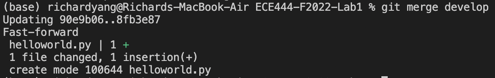
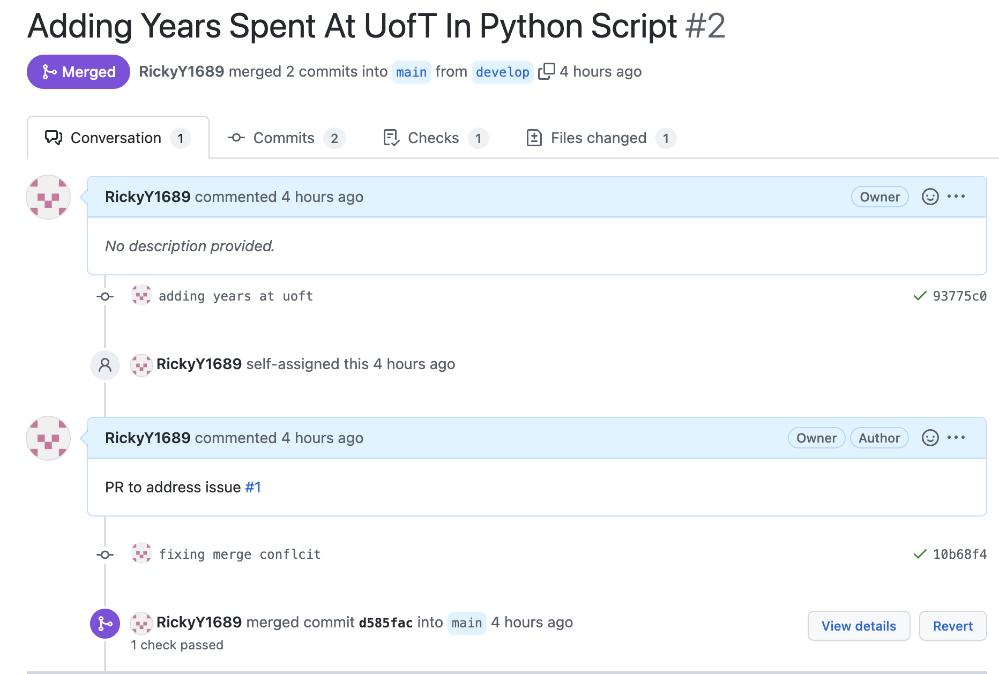
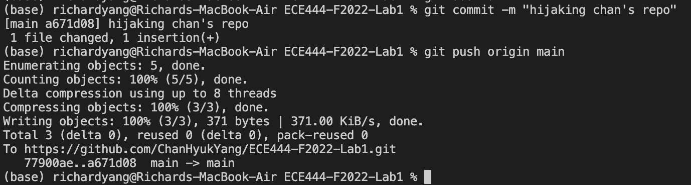
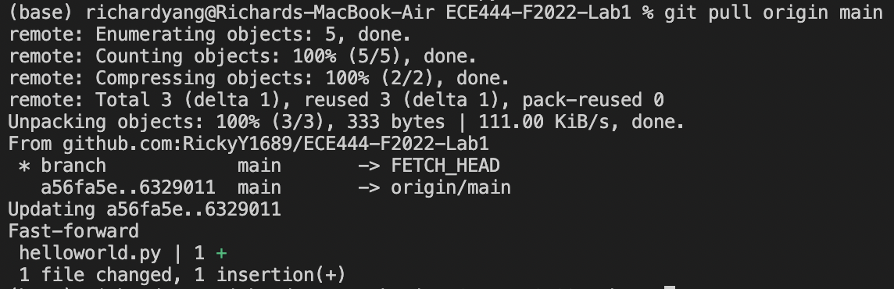

Richard Yang

Activity 1 - Creating README.md commit

Activity 2 - Merging develop into main

Activity 3 - Merging PR for Adding Years Spent at UofT (Squash and merged, hence one commit) 

Activity 4

Commit on Chan Hyuk Yang's PR - [Link](https://github.com/ChanHyukYang/ECE444-F2022-Lab1) 

Pulling Chan's Changes into Remote

