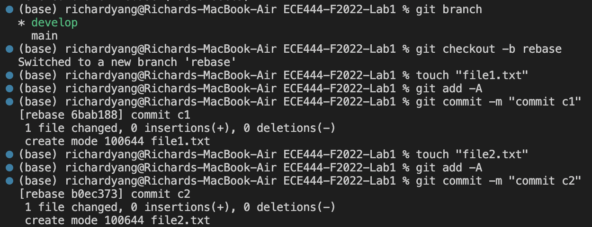
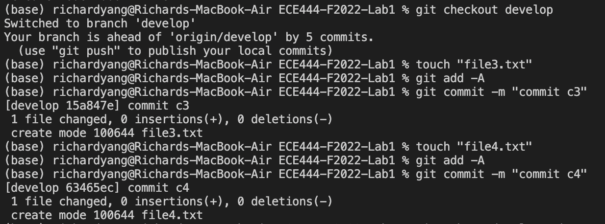
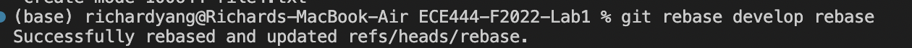
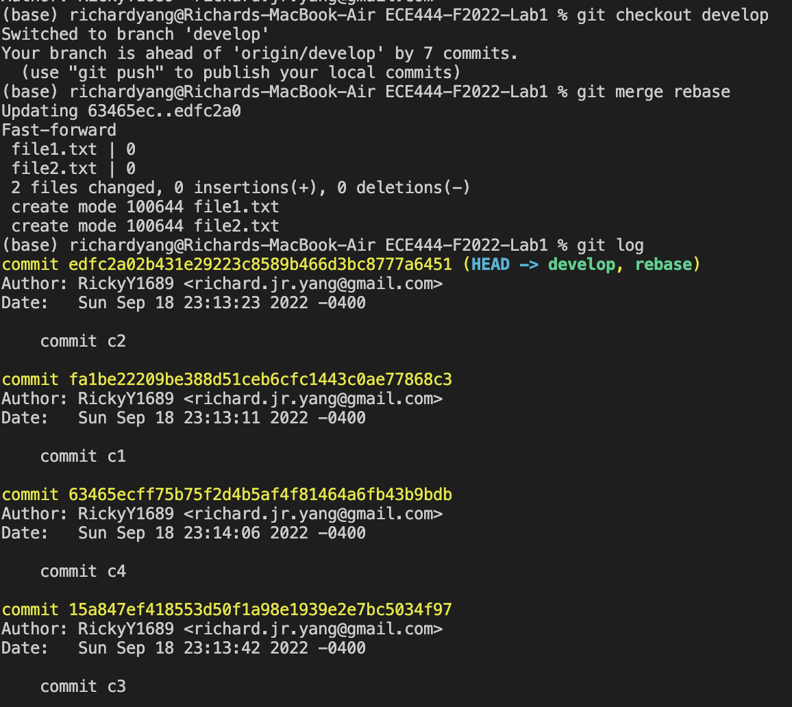
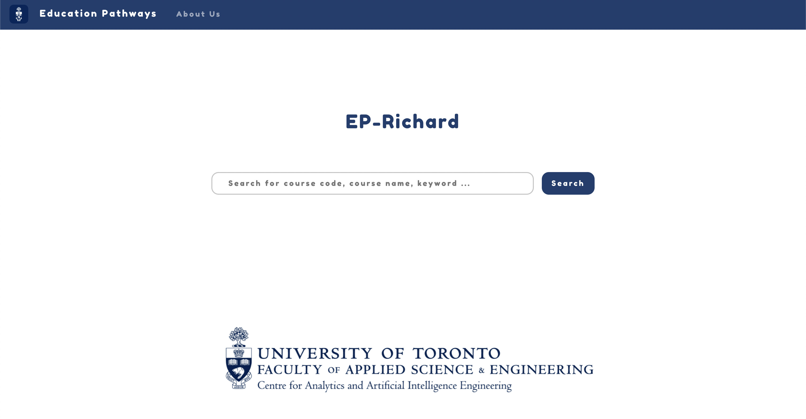
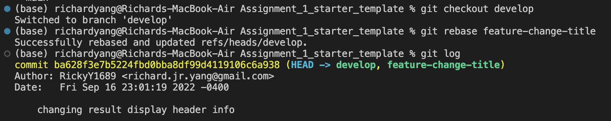
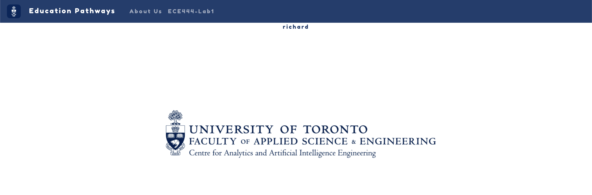
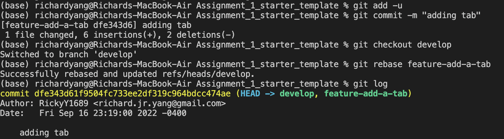

Richard Yang

Activity 1 - Creating README.md commit

Activity 2 - Merging develop into main

Activity 3 - Merging PR for Adding Years Spent at UofT (Squash and merged, hence one commit) 

Activity 4

Commit on Chan Hyuk Yang's PR - [Link](https://github.com/ChanHyukYang/ECE444-F2022-Lab1) 

Pulling Chan's Changes into Remote

Activity 5

Screenshot showing each step outlined in the activity

- Checkout `develop` & create new branch, `rebase`, off of `develop` and created two commits 

- Switched back to `develop` and created two commits

- Rebased the `rebase` branch onto `develop`

- Check back into the `develop` branch and merge `rebase` into `develop` and run `git log` to verify the desired order of commits

Activity 6

Link to the cloned Education Pathways repo can be found [here](https://github.com/RickyY1689/ECE444-F2022-EP)

Actvitiy 7

Results of the title change:

Git commands leading up to and including the rebase:

Activity 8

Screenshot of the updated website

Git commands leading up to and including the rebase

